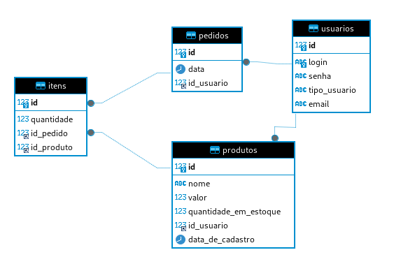
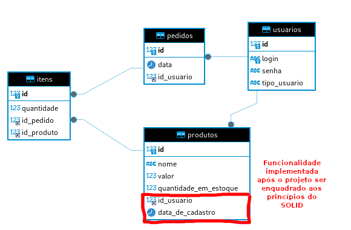

# API Rest de sistema de gerenciamento de cadastro de pedidos

Olá, me chamo Marcelo Viana. Sou iniciante em SpringBoot e criei esse repositório para compartilhar uma experiência.

Recentemente estava criando um sistema de gerenciamento de pedidos e não soube como criar uma entidade que representasse o conjunto de itens de um pedido. Após algumas pesquisas encontrei essa solução e estou compartilhando com a comunidade.

Imagem do projeto representado por DER.

Além do sistema de gerenciamento de pedidos, o código fonte contém implementação de conceitos de qualidade de software baseados nos princípios SOLID e implementação de um sistema de segurança que contém gerenciamento de acesso multicamada com níveis de permissões de acesso diferentes para usuário comum e usuário administrador.

Imagem do projeto representado por DER, após implementação de nova funcionalidade.

