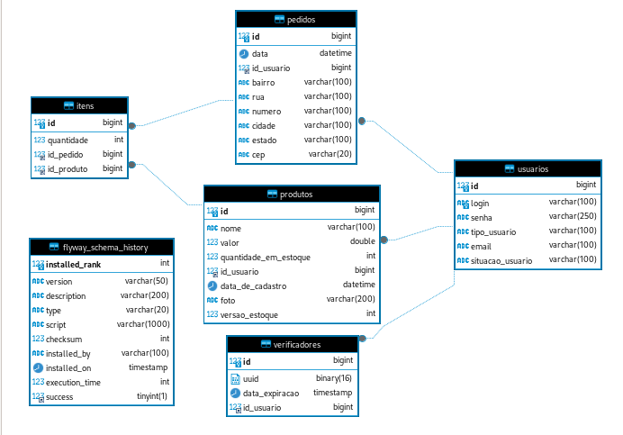

# API Rest de sistema de gerenciamento de cadastro de pedidos

Olá, me chamo Marcelo Viana. Sou iniciante em SpringBoot e criei esse repositório para compartilhar uma experiência.

Recentemente estava criando um sistema de gerenciamento de pedidos e não soube como criar uma entidade que representasse o conjunto de itens de um pedido. Após algumas pesquisas encontrei essa solução e estou compartilhando com a comunidade.

Imagem do projeto representado por DER.

Além do sistema de gerenciamento de pedidos, o código fonte contém:
- Protocolo HTTP aplicado a API Rest
- Comunicação entre API's via JSON
- Implementação de sistemas de autenticação via token JWT
- Controle de acesso multicamada
- Ativação de cadastro de usuário vinculada a e-mail de confirmação
- Persistência de dados vinculada a ORM
- Boas práticas baseadas em conceitos do SOLID
- Testes unitários automatizados
- Transferência de arquivos
- Sincronização de requisições
- Processamento concorrente

Para implementação do sistema de ativação de usuário por email é necessário ter conta gmail e criar uma senha de app. Essa senha pode ser criada pelo próprio sistema de gerenciamento de contas do google.

## Documentation for API Endpoints

All URIs are relative to *http://localhost:8080*

Class | Method | HTTP request | Description
------------ | ------------- | ------------- | -------------
*CadastrarControllerApi* | [**cadastrarUsuario**](docs/CadastrarControllerApi.md#cadastrarUsuario) | **POST** /cadastrar | 
*CadastrarControllerApi* | [**reenviarEmail**](docs/CadastrarControllerApi.md#reenviarEmail) | **GET** /cadastrar/reenviar/{id} | 
*CadastrarControllerApi* | [**verificarCadastroDeUsuario**](docs/CadastrarControllerApi.md#verificarCadastroDeUsuario) | **GET** /cadastrar/{uuid} | 
*LoginControllerApi* | [**efetuarLogin**](docs/LoginControllerApi.md#efetuarLogin) | **POST** /login | 
*PedidoControllerApi* | [**cadastrarPedido**](docs/PedidoControllerApi.md#cadastrarPedido) | **POST** /pedidos | 
*PedidoControllerApi* | [**detalharPedido**](docs/PedidoControllerApi.md#detalharPedido) | **GET** /pedidos/{id} | 
*PedidoControllerApi* | [**excluirPedido**](docs/PedidoControllerApi.md#excluirPedido) | **DELETE** /pedidos/{id} | 
*PedidoControllerApi* | [**listarPedidos**](docs/PedidoControllerApi.md#listarPedidos) | **GET** /pedidos | 
*ProdutoControllerApi* | [**adicionarProdutoEmEstoque**](docs/ProdutoControllerApi.md#adicionarProdutoEmEstoque) | **POST** /produtos/estoque | 
*ProdutoControllerApi* | [**atualizarProduto**](docs/ProdutoControllerApi.md#atualizarProduto) | **PUT** /produtos | 
*ProdutoControllerApi* | [**cadastrarProduto**](docs/ProdutoControllerApi.md#cadastrarProduto) | **POST** /produtos | 
*ProdutoControllerApi* | [**detalharProduto**](docs/ProdutoControllerApi.md#detalharProduto) | **GET** /produtos/{id} | 
*ProdutoControllerApi* | [**listarProdutos**](docs/ProdutoControllerApi.md#listarProdutos) | **GET** /produtos | 
*ProdutoControllerApi* | [**uploadDeFotoDeProduto**](docs/ProdutoControllerApi.md#uploadDeFotoDeProduto) | **POST** /produtos/foto/{id} | 
*UsuarioControllerApi* | [**atualizarUsuario**](docs/UsuarioControllerApi.md#atualizarUsuario) | **PUT** /usuarios | 
*UsuarioControllerApi* | [**detalharUsuario**](docs/UsuarioControllerApi.md#detalharUsuario) | **GET** /usuarios/{id} | 
*UsuarioControllerApi* | [**listarUsuarios**](docs/UsuarioControllerApi.md#listarUsuarios) | **GET** /usuarios | 

## Documentation for Models

 - [DadosAtualizacaoProduto](docs/DadosAtualizacaoProduto.md)
 - [DadosAtualizacaoUsuario](docs/DadosAtualizacaoUsuario.md)
 - [DadosAutenticacaoUsuario](docs/DadosAutenticacaoUsuario.md)
 - [DadosCadastroEndereco](docs/DadosCadastroEndereco.md)
 - [DadosCadastroItem](docs/DadosCadastroItem.md)
 - [DadosCadastroPedido](docs/DadosCadastroPedido.md)
 - [DadosCadastroProduto](docs/DadosCadastroProduto.md)
 - [DadosCadastroProdutoEstoque](docs/DadosCadastroProdutoEstoque.md)
 - [DadosCadastroUsuario](docs/DadosCadastroUsuario.md)
 - [DadosDetalhamentoItem](docs/DadosDetalhamentoItem.md)
 - [DadosDetalhamentoPedido](docs/DadosDetalhamentoPedido.md)
 - [DadosDetalhamentoProduto](docs/DadosDetalhamentoProduto.md)
 - [DadosDetalhamentoUsuario](docs/DadosDetalhamentoUsuario.md)
 - [FotoIdBody](docs/FotoIdBody.md)
 - [Pageable](docs/Pageable.md)

